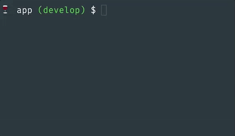

# co

Easily `checkout`/`delete` your local git branches from an interactive CLI.



Made with [Inquirer.js](https://github.com/SBoudrias/Inquirer.js) + some arrow functions.

## Installation

```bash
$ npm i -g @fbarrailla/co
```

## Usage

```bash
$ co
```
